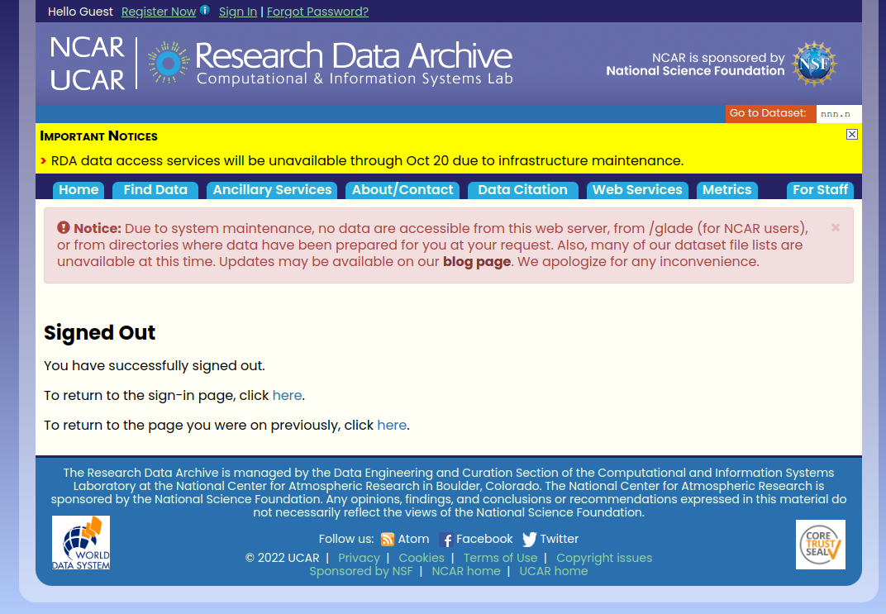

# Download de dados sinóticos

1. Entrar no site da UCAR ([NCAR's Research Data Archive](https://rda.ucar.edu/))

- Criar uma conta.

2. Buscar o Dataset, pode ser feito de 2 maneiras:

- Se conhece a série de dados (Go Dataset)

-  Se não conhece (Find Data, All Datasets)

3. Entrar no Data Access (Web File Listing)

4. Faceted Browse	ou Complete File List

5. Seleciona os dados 

6. Gerar o script para download dos dados

7. Rodar o script no servidor (cluster)