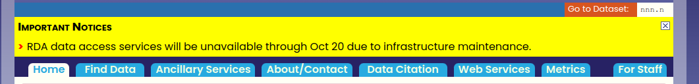
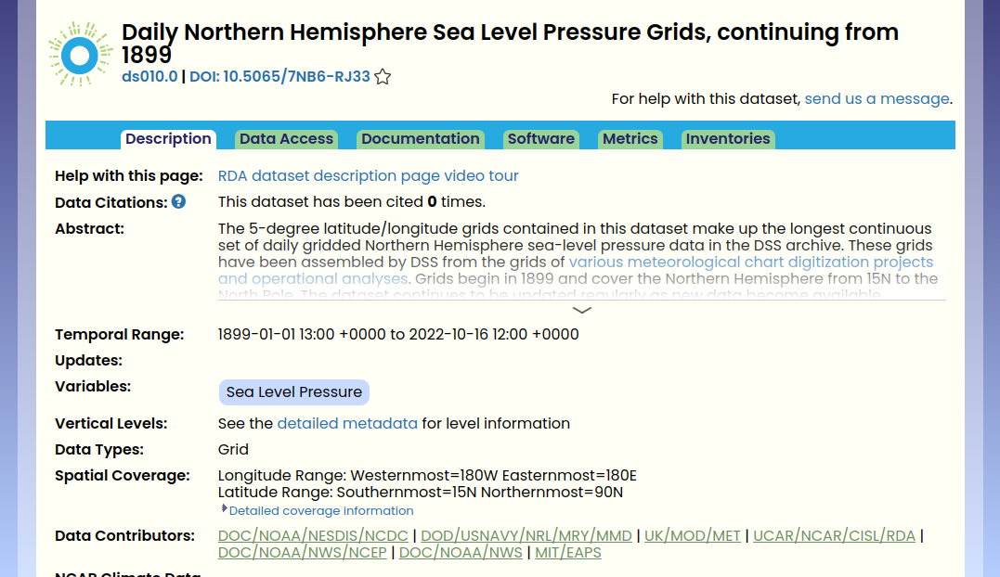
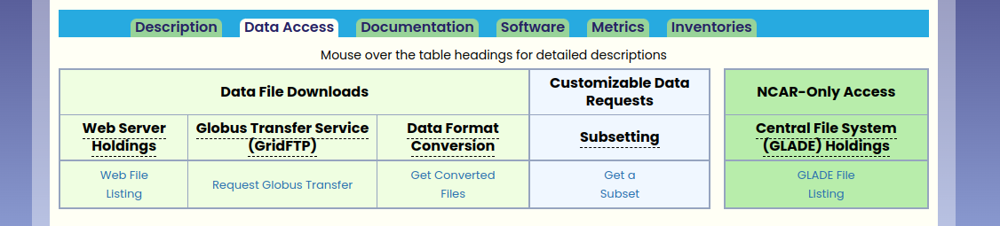

# Download de dados sinóticos

1. Entrar no site da UCAR ([NCAR's Research Data Archive](https://rda.ucar.edu/)).

- Antes de continuar será necessario `criar uma conta`. Para isto entra no `Sign In` na parte superior do site.

2. Buscar o Dataset, pode ser feito de 2 maneiras:

- Se conhece a série de dados va em `Go to Dataset` e coloca a identificação da base de dados.

- Se não conhece a base de dados apenas coloca o mouse sobre `Find Data`, isto deve mostrar varias opções, para ver todas faça click em `All Datasets` e confira.

Depois de ter localizado a base de dados de interesse faça `click` na base, deve aparecer uma janela nova com estrutura parecida com:

3. Entrar no Data Access, nesta  entra no `Web File Listing` que esta na coluna do **Web Server Holdings**

4. Dependendo da base de dados podem ter as opções `Faceted Browse` ou `Complete File List` ou o usuario será direcionado diretamente para a lista de dados disponíveis.

5. Seleciona os dados 

6. Gerar o script para download dos dados

7. Rodar o script no servidor (cluster)